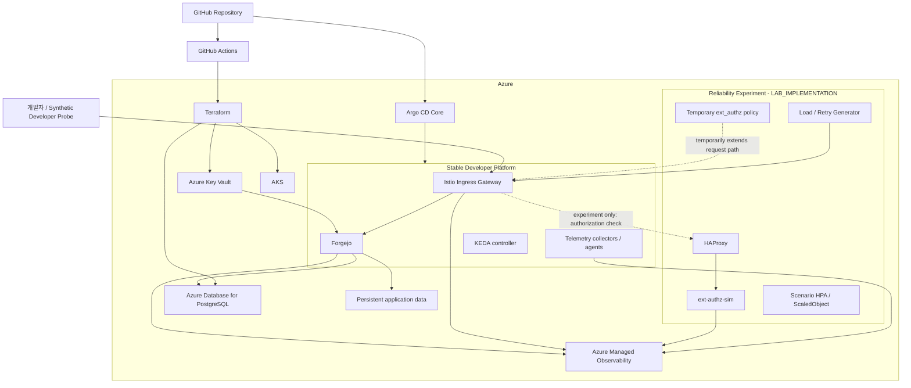

# Architecture

## 1. 목적

이 문서는 현재 합의된 **책임 경계와 control plane**을 정의한다. 구현 전에 변할 수 있는 exact SKU, threshold, patch version 같은 값은 여기서 고정하지 않는다.

## 2. 전체 구조



## 3. Control plane 역할

### Terraform

Azure resource lifecycle을 담당한다.

`infra/terraform/`은 lifecycle에 따라 세 stack으로 나눈다.

- `bootstrap/`: remote state와 CI federation을 만들기 위한 최소 resource
- `foundation/`: DNS, Key Vault, shared identity처럼 environment보다 긴 lifecycle의 resource
- `environment/`: AKS, PostgreSQL, observability 등 실험 때 만들고 지우는 resource

`bootstrap/`만 chicken-and-egg 문제 때문에 local state를 허용한다. 나머지 state는 Azure Blob backend를 사용한다.

### GitHub Actions

다음을 담당한다.

- test / lint / static validation
- Terraform plan
- image build와 registry push
- security/dependency checks
- 명시적으로 승인된 Azure apply/destroy orchestration
- smoke / E2E / experiment workflow orchestration

Stable Kubernetes platform을 장기적으로 직접 `helm upgrade`하는 control plane으로 사용하지 않는다.

### Argo CD Core

`platform/` 아래의 stable platform desired state를 reconcile한다.

Core 계약:

- automated sync 사용
- self-heal 사용
- automatic prune은 Core에서 사용하지 않음
- final evidence run은 exact commit SHA를 `targetRevision`으로 사용
- experiment fixture는 Argo CD scope 밖

Local fast inner loop는 direct deploy를 허용하지만, GitOps integration test에서는 Argo CD reconciliation을 반드시 검증한다.

### Experiment runner

`experiments/` 아래의 temporary reliability state를 소유한다.

예:

- synthetic shared gate
- HAProxy
- ext-authz-sim
- temporary Istio authorization policy
- HPA / KEDA ScaledObject
- load/retry configuration
- fault configuration

Experiment 종료 후 자신이 만든 resource를 제거해야 한다.

## 4. Stable platform

### Forgejo

Core 운영 profile:

- v15 LTS 계열 exact patch pin
- replica 1
- Recreate deployment strategy
- HTTPS Git만 Core 범위
- PostgreSQL 외부 database
- persistent application data
- DB-backed session
- bounded `twoqueue` cache
- persistent `level` queue

이 조합은 Forgejo의 유일한 권장 정답이 아니라 이 프로젝트의 ADR이다. 실제 동작은 integration/recovery test로 검증한다.

### PostgreSQL

Azure Database for PostgreSQL Flexible Server를 사용한다.

- public internet에 직접 노출하지 않는다.
- AKS에서 private network로 접근한다.
- evidence run에서는 DB가 실험의 primary bottleneck이 아니어야 한다.
- Azure PITR는 DB recovery layer이며 Forgejo 전체 backup을 대체하지 않는다.

### Storage

Forgejo의 repository와 application data는 persistent volume에 저장한다.

Backup은 DB와 file state를 함께 다루어야 한다.

### Ingress / TLS

- 외부 공개 경로는 HTTPS ingress 하나를 원칙으로 한다.
- project subdomain은 Azure DNS에 위임한다.
- cert-manager와 DNS-01을 사용한다.
- 장기 Azure credential을 Kubernetes Secret에 저장하지 않는다.

### Secrets

Persistent platform secret:

```text
Azure Key Vault
→ Workload Identity
→ Secrets Store CSI
→ workload
```

Experiment-only token은 ephemeral Kubernetes Secret을 허용하며 environment/namespace lifecycle과 함께 제거한다.

## 5. Azure network와 compute boundary

Core 방향:

- Azure CNI Overlay
- system node pool과 user node pool 분리
- system pool은 application workload를 받지 않음
- evidence run 중 node capacity는 고정
- Cluster Autoscaler를 실험 변수에 포함하지 않음
- PostgreSQL은 private network 사용
- public exposure는 ingress에 한정

Exact node SKU와 count는 calibration 후 결정한다.

원칙은 **node/Forgejo/DB가 먼저 포화되지 않고, 의도적으로 제한한 reliability fixture가 먼저 bottleneck이 되도록 충분한 headroom을 확보하는 것**이다.

## 6. Developer request path

정상 상태:

```text
Developer
→ HTTPS
→ Istio Ingress Gateway
→ Forgejo
→ native authentication / authorization
→ PostgreSQL + repository storage
```

Reliability experiment에서만:

```text
Developer
→ Istio Ingress Gateway
→ ext_authz check
   → HAProxy
   → Envoy sidecar
   → ext-authz-sim
→ ALLOW
→ original request
→ Forgejo
→ Forgejo native authentication / authorization
```

`ext-authz-sim`은 Forgejo 인증을 대체하지 않는다.

## 7. Reliability fixture 경계

Synthetic shared gate는 GitHub 내부 auth architecture를 복제한 것이 아니다.

목적은 다음 failure effect를 통제 가능한 형태로 연구하는 것이다.

- shared mandatory path
- request-concurrency saturation
- autoscaling signal mismatch
- retry amplification
- upstream overload propagation
- mitigation과 recovery

Git push body 전체를 authorization service로 proxy하지 않는다. Gateway는 최소 request metadata만 authorization check에 사용한다.

## 8. Observability

### 수집

`platform/telemetry/`가 수집/전송 설정을 소유한다.

### 운영 해석

`operations/`가 SLO, alert, dashboard, query, runbook을 소유한다.

역할:

- metrics: saturation / scaling / throughput의 정량 관찰
- logs: 오류와 이벤트 확인
- traces: request path와 latency 분해
- developer probe: 실제 사용자 행동 결과

최상위 신호는 developer operation이다.

## 9. Test와 experiment 경계

`tests/`:

- 정상 시스템이 요구사항을 만족하는지 검증
- unit / integration / e2e / infrastructure / recovery / upgrade

`experiments/`:

- 정상 시스템에 의도적으로 failure condition을 적용
- 사용자 영향과 mitigation을 측정

Reliability experiment는 관련 정상 E2E가 먼저 통과해야 실행할 수 있다.

## 10. Evidence boundary

Raw result는 append-only로 생성하고 Git에서 기본 제외한다.

Published evidence에는 다음만 남긴다.

- run identity와 source revision
- component version / image digest
- scenario condition
- developer-operation measurement
- mechanism measurement
- confounder guard
- cleanup/teardown result

가설과 반대 결과라도 실험 조건이 유효하면 valid run이다.

## 11. Production-readiness boundary

이 프로젝트는 **production-minded**이지 실제 production service가 아니다.

의도적인 차이:

- single region
- ephemeral Azure runtime
- Forgejo single replica
- Core에서 multi-region/HA 제외
- evidence를 위해 node capacity 고정
- Argo CD Core 사용
- small operator model

각 차이는 숨기지 않고 문서화하며, production 환경으로 확장할 때 재검토해야 한다.
