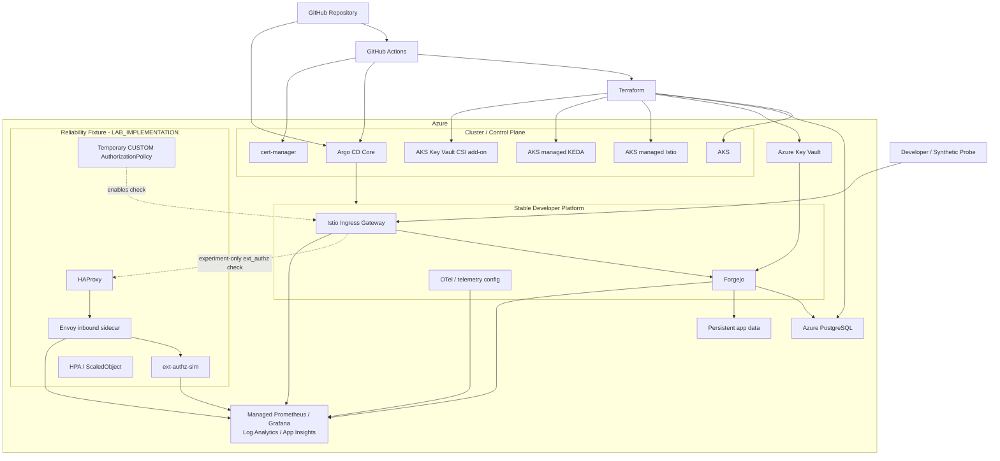

# Architecture

## 1. 목적

이 문서는 이 프로젝트의 **책임 경계, control plane, 정상 request path와 reliability experiment path**를 정의한다.

Exact SKU, SLO threshold, KEDA threshold처럼 baseline/calibration이 필요한 값은 여기서 고정하지 않는다. 실제 구현 순서는 [Implementation Plan](implementation-plan.md)을 따른다.

---

## 2. 전체 구조



---

## 3. Control plane 역할

### Terraform / AKS managed lifecycle

Terraform은 Azure resource와 Azure-managed capability의 lifecycle을 담당한다.

`infra/terraform/`:

- `bootstrap/`: remote state 기반
- `foundation/`: DNS, Key Vault, identity/RBAC 등 긴 lifecycle
- `environment/`: AKS, PostgreSQL, storage, observability 등 ephemeral runtime

Azure에서는 cluster-scoped controller를 불필요하게 직접 운영하지 않기 위해 다음을 managed add-on으로 우선 사용한다.

- Istio service mesh add-on
- KEDA add-on
- Azure Key Vault provider for Secrets Store CSI Driver

### GitHub Actions

- CI / static validation
- build
- Terraform orchestration
- explicit cluster bootstrap
- smoke / E2E / experiment orchestration

Azure apply/destroy는 자동 PR side effect로 실행하지 않는다.

### Explicit cluster bootstrap

Argo CD AppProject의 권한을 확대하지 않기 위해 cluster-scoped lifecycle을 별도로 둔다.

예:

- Argo CD Core 자체
- cert-manager controller
- AKS Istio revision-specific shared MeshConfig

### Argo CD Core

Argo CD는 **stable namespaced desired state**를 기본 경계로 한다.

Core 계약:

- exact revision
- auto-sync
- self-heal
- automatic prune off
- narrow source/destination scope
- cluster-wide wildcard privilege를 추가하지 않음

현재 검증된 Forgejo Application은 `platform` namespace만 대상으로 한다.

### Experiment runner

Temporary reliability state를 소유한다.

- HAProxy
- ext-authz-sim
- `AuthorizationPolicy`
- experiment `Sidecar` connection-pool setting
- HPA / ScaledObject
- load/fault configuration

Argo CD가 소유하는 stable resource를 직접 수정하지 않는다.

---

## 4. Stable platform

### Forgejo

- v15 LTS track
- evidence run은 exact patch/image digest 기록
- replica 1
- Recreate
- Azure Core: HTTPS Git only
- native Forgejo authentication/authorization 유지
- external PostgreSQL
- persistent application data
- session=db
- cache=twoqueue
- queue=level
- SSH / Actions / Packages / migration 비활성화

Local correctness E2E는 port-forward된 HTTP endpoint를 개발용 예외로 사용한다.

### PostgreSQL

Azure Database for PostgreSQL Flexible Server를 사용한다.

- private network
- Forgejo와 DB lifecycle 분리
- PITR는 추가 DB recovery layer
- Forgejo 전체 backup 대체 아님

### Secrets

```text
Azure Key Vault
→ Workload Identity
→ Secrets Store CSI
→ workload
```

Experiment-only secret은 ephemeral Kubernetes Secret을 사용할 수 있다.

### Ingress / TLS

- Azure 외부 공개 경로는 HTTPS ingress 하나
- project subdomain을 Azure DNS에 위임
- cert-manager DNS-01
- direct Forgejo public bypass 금지

---

## 5. Azure network / compute boundary

Core:

- Azure CNI Overlay
- dedicated system node pool
- dedicated user node pool
- PostgreSQL private access
- public ingress only
- evidence run node capacity fixed

Exact SKU는 calibration 후 고정한다.

비용을 줄이기 위해 의도하지 않은 node/DB bottleneck을 만들지 않는다. PAYG 비용은 환경 runtime을 짧게 유지하는 방식으로 제어한다.

---

## 6. 정상 developer request path

Azure:

```text
Developer
→ HTTPS
→ Istio Ingress Gateway
→ Forgejo
→ Forgejo native authentication / authorization
→ PostgreSQL + repository storage
```

Synthetic gate는 정상 상태의 필수 dependency가 아니다.

---

## 7. Reliability experiment request path

```text
Developer / Load client
→ Istio Ingress Gateway
→ CUSTOM ext_authz check
   → HAProxy
   → ext-authz-sim Pod
      → Envoy inbound sidecar
      → ext-authz-sim app
→ ALLOW / DENY
→ Istio Ingress Gateway
→ original request
→ Forgejo native authentication / authorization
```

### ext-authz 경계

`ext-authz-sim`은 실제 사용자 identity source가 아니며 Forgejo permission을 대체하지 않는다.

Gateway가 보내는 authorization check에는 필요한 request metadata만 사용한다. Git push body 전체를 custom service로 중계하지 않는다.

### 의도적으로 포화시키는 proxy

Capacity target은 **ext-authz-sim Pod의 inbound Envoy sidecar**다.

Istio `Sidecar.inboundConnectionPool`을 이용해 inbound active-request limit을 구성한다.

이 구조는 다음 비교를 가능하게 한다.

```text
Application CPU may remain low
        ↓
Envoy inbound request limit saturates
        ↓
request rejection
        ↓
application-CPU HPA may not react
```

그리고 같은 ext-authz Deployment를 Envoy signal 기반 KEDA와 비교한다.

HAProxy는 별도의 queue/admission/rate-limiting layer다.

---

## 8. AKS managed Istio 사용 조건

Azure Core는 AKS managed Istio add-on을 우선한다.

그러나 managed라고 해서 실험 capability를 가정하지 않는다.

Selected AKS/Istio revision에서 다음 preflight를 통과해야 한다.

- sidecar injection
- MeshConfig `extensionProviders`
- `CUSTOM AuthorizationPolicy`
- `Sidecar.inboundConnectionPool`
- Envoy rejection metric
- policy/fixture 제거 후 normal E2E

필수 기능이 blocked되거나 재현 불가능하면 그때만 self-managed Istio fallback ADR을 연다.

Local은 selected AKS revision과 가능한 한 같은 upstream Istio minor를 사용해 behavioral parity를 검증한다.

---

## 9. Autoscaling

Blind comparison:

```text
ext-authz application container CPU
→ Kubernetes HPA
```

Proxy-signal comparison:

```text
Envoy capacity/saturation metric
→ Azure Managed Prometheus
→ AKS KEDA add-on
→ ext-authz Deployment
```

두 scaling controller를 같은 scenario에서 동시에 활성화하지 않는다.

Exact metric/query/threshold는 실제 metric capture와 calibration 후 확정한다.

---

## 10. Observability

### Metrics

- developer probe
- Forgejo
- Istio/Envoy
- HAProxy
- ext-authz-sim
- HPA/KEDA
- node/Kubernetes
- PostgreSQL

→ Azure Managed Prometheus / Managed Grafana

### Logs

→ Log Analytics

### Traces

mesh/proxy + ext-authz-sim
→ OTel Collector
→ Application Insights

최상위 user signal은 developer operation이다. Telemetry는 그 원인을 설명하는 diagnostic signal이다.

---

## 11. Test / experiment 경계

`tests/`:

> 정상 시스템이 요구사항을 만족하는가?

`experiments/`:

> 정상 시스템에 의도한 failure condition을 적용하면 무엇이 일어나는가?

Experiment 전 관련 normal E2E가 통과해야 한다.

---

## 12. Evidence boundary

Final evidence는 네 층으로 본다.

1. Developer impact
2. Failure mechanism
3. Confounder guard
4. Recovery / cleanup

필수 provenance:

- source commit
- clean/dirty state
- runtime versions/digests
- topology
- scenario configuration
- observation window
- cleanup result

가설과 반대 결과라도 valid run이면 버리지 않는다.

---

## 13. Production-readiness boundary

이 프로젝트는 production-minded이지 production-ready라고 주장하지 않는다.

상세 차이는 [Production Readiness Boundary](production-readiness.md)에 기록한다.
