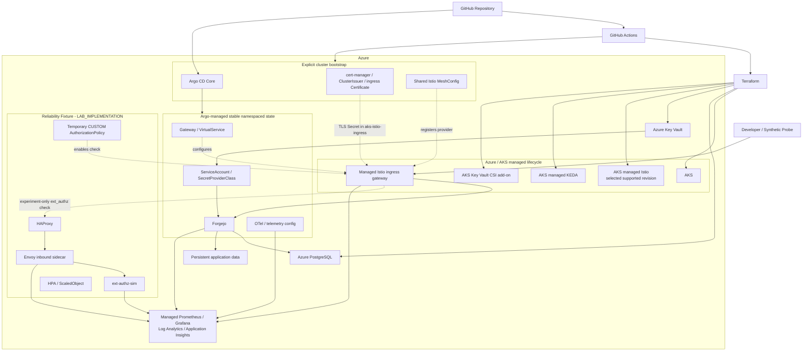

# Architecture

## 1. 목적

이 문서는 이 프로젝트의 **책임 경계, control plane, 정상 request path, reliability experiment path**를 정의한다.

Exact Azure SKU, SLO threshold, KEDA threshold처럼 측정과 preflight가 필요한 값은 여기서 고정하지 않는다. 실제 구현 순서는 [Implementation Plan](implementation-plan.md)을 따른다.

---

## 2. 전체 구조



---

## 3. Control-plane ownership

### Terraform

Terraform은 Azure resource와 Azure-managed capability를 소유한다.

Lifecycle stack:

- `bootstrap/`: state, CI identity, permission-boundary resource groups
- `foundation/`: DNS, Key Vault, persistent shared identity/RBAC
- `environment/`: AKS, PostgreSQL, storage, observability, ephemeral runtime

Azure에서는 다음을 managed add-on으로 우선 사용한다.

- Istio service mesh add-on
- KEDA add-on
- Azure Key Vault provider for Secrets Store CSI Driver

### GitHub Actions

담당:

- CI / static validation
- custom image build
- Terraform orchestration
- explicit cluster bootstrap
- smoke / E2E / experiment orchestration

PR workflow가 Azure `apply`를 자동 side effect로 실행하지 않는다.

### Explicit cluster bootstrap

Cluster-scoped 또는 AKS-managed resource integration은 Argo AppProject에 억지로 넣지 않는다.

예:

- Argo CD Core install
- cert-manager controller
- Azure DNS Workload Identity를 사용하는 ACME `ClusterIssuer`
- `aks-istio-ingress` namespace의 ingress `Certificate`
- revision-specific Istio shared MeshConfig
- managed ingress Service의 supported Azure Load Balancer annotation

### Argo CD Core

Argo는 **stable namespaced desired state**를 기본 관리 범위로 한다.

예:

- Forgejo
- Istio `Gateway` / `VirtualService`
- Forgejo workload ServiceAccount / SecretProviderClass
- namespaced telemetry config

Application 계약:

- exact Git revision
- auto-sync
- self-heal
- automatic prune off
- narrow source/destination
- experiment resource 미관리

#### 보안 경계

AppProject 제한과 Argo controller의 Kubernetes RBAC는 다른 개념이다.

Upstream Argo CD Core same-cluster install은 controller에 넓은 cluster-level 권한을 부여할 수 있다. 이 프로젝트는 single-operator ephemeral environment에서 이를 의도적인 production-readiness deviation으로 받아들이되:

- AppProject scope를 불필요하게 넓히지 않고
- managed add-on controller를 Argo에 넣지 않고
- cluster-scoped resource를 이유 없이 추가하지 않는다.

별도의 Argo controller RBAC hardening은 실제 필요가 생길 때만 검토한다.

### Experiment runner

실험에서만 존재하거나 바뀌는 state를 소유한다.

- HAProxy
- ext-authz-sim
- temporary `AuthorizationPolicy`
- experiment `Sidecar`
- HPA / ScaledObject
- load/fault resource

Argo가 소유하는 stable resource를 직접 mutation하지 않는다.

---

## 4. Stable developer platform

### Forgejo

Core contract:

- Forgejo v15 LTS track
- final evidence에서 exact patch/image digest 기록
- replica 1
- Recreate
- Azure: HTTPS Git only
- Forgejo native authentication/authorization 유지
- external PostgreSQL
- persistent application data
- session `db`
- cache `twoqueue`
- queue `level`
- SSH disabled
- Actions / Packages / repository migration disabled

Local correctness E2E는 port-forward된 HTTP endpoint를 개발용 예외로 사용한다.

### PostgreSQL

Azure Database for PostgreSQL Flexible Server.

- private network
- Forgejo lifecycle과 DB state 분리
- experiment primary bottleneck이 아니어야 함
- PITR는 DB recovery layer
- Forgejo 전체 coordinated backup의 대체가 아님

### Secrets

Azure:

```text
Azure Key Vault
→ Workload Identity
→ Secrets Store CSI
→ workload
```

Persistent cryptographic material은 Pod lifecycle과 분리한다.

Experiment-only secret은 ephemeral Kubernetes Secret을 사용할 수 있다.

### TLS / DNS

- 가비아 parent domain 전체를 Azure로 이전하지 않음
- project subdomain만 Azure DNS로 위임
- cert-manager ACME DNS-01 사용
- Azure DNS 인증은 cert-manager Workload Identity 사용
- Core에서는 `ClusterIssuer`를 사용한다. Azure DNS ambient credential은 `ClusterIssuer`에 기본 지원되며, namespaced `Issuer`를 위해 controller credential 범위를 추가로 넓히지 않는다.
- managed Istio ingress가 참조하는 TLS Secret은 `aks-istio-ingress` namespace에 있어야 하므로 ingress `Certificate`도 explicit cluster bootstrap이 관리한다.
- ingress TLS 인증서는 Key Vault persistent workload secret과 별도 lifecycle로 취급한다.
- `Gateway`의 `credentialName`은 `aks-istio-ingress`에 생성되는 TLS Secret 이름과 일치해야 한다.
- direct Forgejo public bypass 금지

---

## 5. Network / compute boundary

Core:

- Azure CNI Overlay
- system node pool과 user node pool 분리
- PostgreSQL private access
- public exposure는 managed Istio HTTPS ingress
- final evidence에서 node capacity fixed

Exact SKU/count는 calibration 후 고정한다.

비용 때문에 node를 작게 만들어 unintended bottleneck을 만들지 않는다. 비용은 environment runtime을 짧게 유지해 제어한다.

---

## 6. Managed Istio boundary

Azure Core는 AKS managed Istio add-on을 우선한다.

### Version requirement

Reliability experiment는 `Sidecar.inboundConnectionPool`을 사용한다.

Selected Azure managed revision은 chosen AKS version/region에서 현재 지원 중이어야 하며, `Sidecar.inboundConnectionPool`과 필요한 ext_authz configuration이 실제 admission/runtime에서 동작하는지 preflight로 확인한다. `inboundConnectionPool` 자체를 특정 revision floor의 근거로 사용하지 않는다.

Exact revision은 region/AKS support preflight 후 고정한다.

Local reliability work도 가능한 한 Azure candidate와 같은 Istio minor를 사용하고 exact patch를 pin한다.

### Managed ingress ownership

Ingress gateway Deployment/Service는 AKS add-on 영역이다.

Terraform:

- static public IP 준비

Explicit bootstrap:

- supported Azure Load Balancer Service annotation 적용

Argo:

- `Gateway` / `VirtualService` 같은 namespaced routing config

### External authorization capability

Selected revision에서 반드시 검증:

- sidecar injection
- MeshConfig `extensionProviders`
- `CUSTOM AuthorizationPolicy`
- `Sidecar.inboundConnectionPool`
- Envoy rejection metric
- policy 제거 후 정상 E2E

필수 capability가 blocked되거나 재현 불가능할 때만 self-managed Istio fallback ADR을 연다.

`EnvoyFilter`는 Core 기본 해법으로 사용하지 않는다.

---

## 7. Normal request path

Azure normal state:

```text
Developer
→ HTTPS
→ AKS managed Istio ingress gateway
→ Forgejo
→ native authentication / authorization
→ PostgreSQL + repository storage
```

Synthetic shared gate는 정상 플랫폼의 필수 dependency가 아니다.

---

## 8. Reliability experiment path

```text
Developer / Load client
→ Istio ingress gateway
→ CUSTOM ext_authz check
   → HAProxy
   → ext-authz-sim Service
   → Envoy inbound sidecar
   → ext-authz-sim app
→ ALLOW / DENY
→ ingress gateway
→ original request
→ Forgejo native authentication / authorization
```

### ext-authz 경계

`ext-authz-sim`은 사용자 identity source가 아니며 Forgejo auth/permission을 대체하지 않는다.

Check request에는 필요한 metadata만 사용하며 Git push body 전체를 custom service로 전달하지 않는다.

### Capacity target

의도적으로 포화시키는 target은 **ext-authz-sim Pod의 inbound Envoy sidecar**다.

`Sidecar.inboundConnectionPool.http.http2MaxRequests`를 사용한다. 이 필드는 이름과 달리 HTTP/1.1과 HTTP/2 모두에 적용되는 최대 active request 수다. 예상되는 Envoy rejection 신호는 `upstream_rq_active_overflow`이며, 실제 selected revision에서 preflight로 확인한다.

```text
application CPU may remain low
        ↓
Envoy inbound request limit saturates
        ↓
request rejection
        ↓
application-container CPU HPA may not react
```

HAProxy는 별도의 queue/admission/rate-limiting layer다.

---

## 9. Autoscaling

Blind comparison:

```text
ext-authz-sim application container CPU
→ Kubernetes HPA
```

Proxy-signal comparison:

```text
Envoy saturation/concurrency metric
→ Azure Managed Prometheus
→ AKS managed KEDA
→ ext-authz-sim Deployment
```

HPA와 KEDA를 한 scenario에서 동시에 같은 Deployment에 연결하지 않는다.

Exact metric/query/threshold는 metric capture/calibration 후 고정한다.

---

## 10. Observability

### User signal

최상위 신호:

- developer operation success/failure
- developer operation latency
- operation attempt count

### Diagnostic metrics

- Forgejo
- Istio/Envoy
- HAProxy
- ext-authz-sim
- HPA/KEDA
- Kubernetes/node
- PostgreSQL

→ Azure Managed Prometheus / Managed Grafana

### Logs

→ Log Analytics

### Traces

mesh/proxy + ext-authz-sim
→ OTel Collector
→ Application Insights

Forgejo internal function-level tracing을 Core requirement로 두지 않는다.

---

## 11. Test / experiment boundary

`tests/`:

> 정상 시스템이 요구사항을 만족하는가?

`experiments/`:

> 정상 시스템에 의도한 failure condition을 적용하면 무엇이 일어나는가?

Experiment 전 관련 normal E2E가 통과해야 한다.

Shell E2E는 correctness test다. 지속적인 SLI 측정은 기존 Git CLI/curl 동작을 재사용하는 structured probe가 담당하고, bulk/retry load는 k6를 우선 사용한다. 별도 Go probe binary는 shell 기반 측정이 실제 한계에 부딪힐 때만 도입한다.

---

## 12. Evidence boundary

Final evidence는 네 층으로 본다.

1. Developer impact
2. Failure mechanism
3. Confounder guard
4. Recovery / cleanup

필수 provenance:

- source commit
- clean/dirty state
- runtime versions/digests
- topology
- scenario configuration
- observation window
- cleanup result

가설과 반대 결과라도 valid run이면 버리지 않는다.

---

## 13. Production-readiness boundary

이 프로젝트는 production-minded이지 production-ready라고 주장하지 않는다.

상세 차이는 [Production Readiness Boundary](production-readiness.md)에 기록한다.
